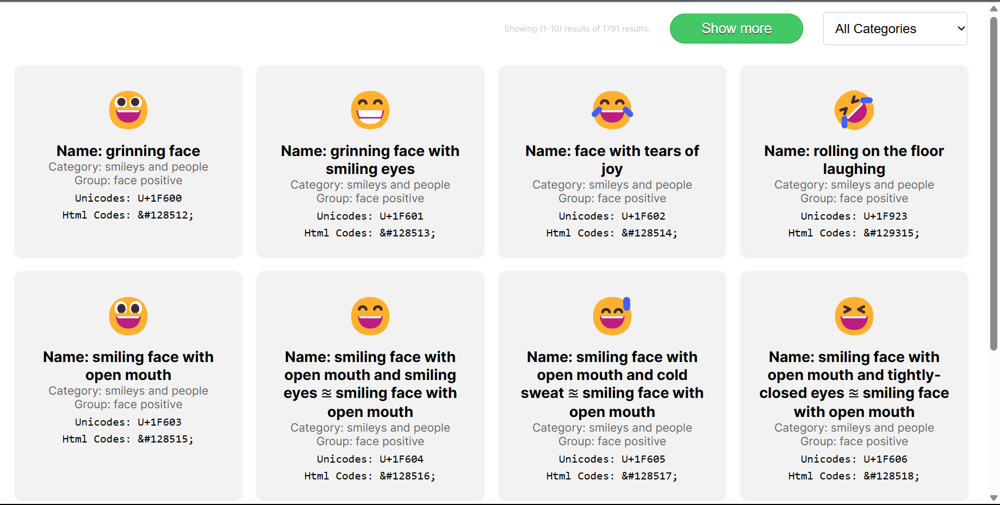
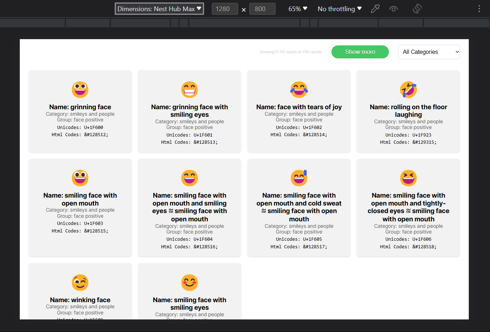
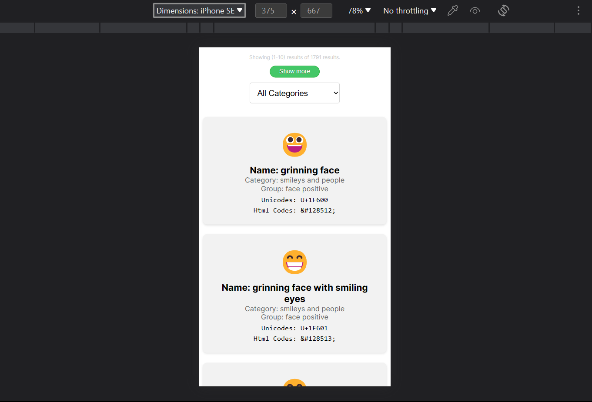

This is a [Next.js](https://nextjs.org/) project bootstrapped with [`create-next-app`](https://github.com/vercel/next.js/tree/canary/packages/create-next-app).

## App Screenshots







## Getting Started

Install Dependencies or code files:

```bash
git clone https://github.com/sedhha/emojis-hub
cd emojis-hub
yarn
# or
npm install
```

Please note that I am using `yarn` instead of `npm` or `pnpm`. In order to ensure same packages are used, I would highly recomment using `yarn` instead of `npm`.

First, run the development server:

```bash
yarn dev
# or
npm run dev
```

Open [http://localhost:3000](http://localhost:3000) with your browser to see the result.

## Tech Stack Used

- Next JS
- Vercel
- CSS Modules
- Axios
- NEXT APIs

## Other Projects

I have intentionally added a footer which is showcase of all my other projects. However it could easily be removed by clicking on `close this` button:


In case you want to re-view the footer, you can add this to end of your web URL:
`?showOtherProjects=1`

For example: `http://localhost:3000/?showOtherProjects=1`
